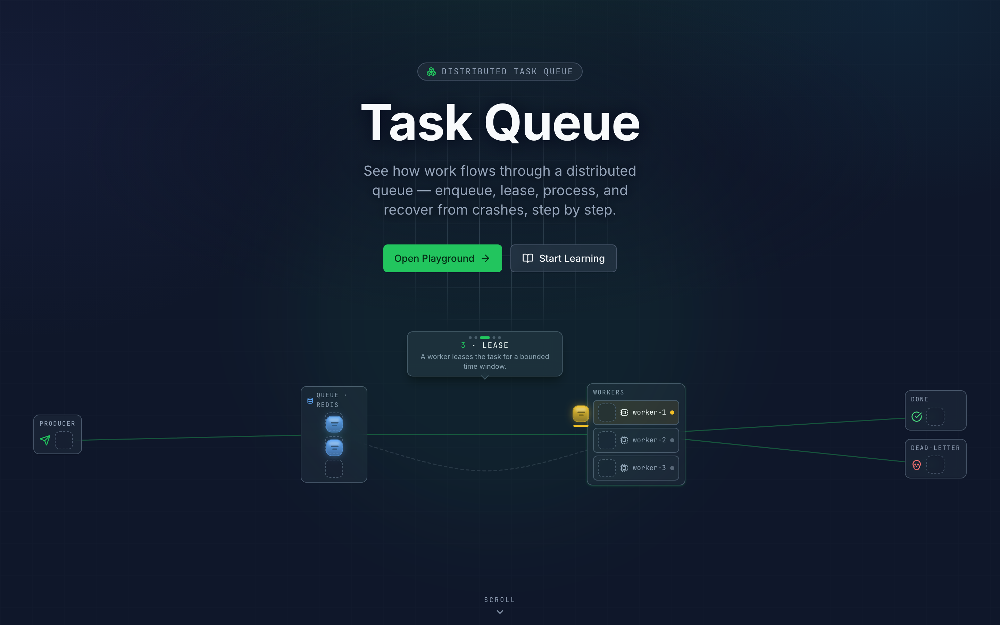
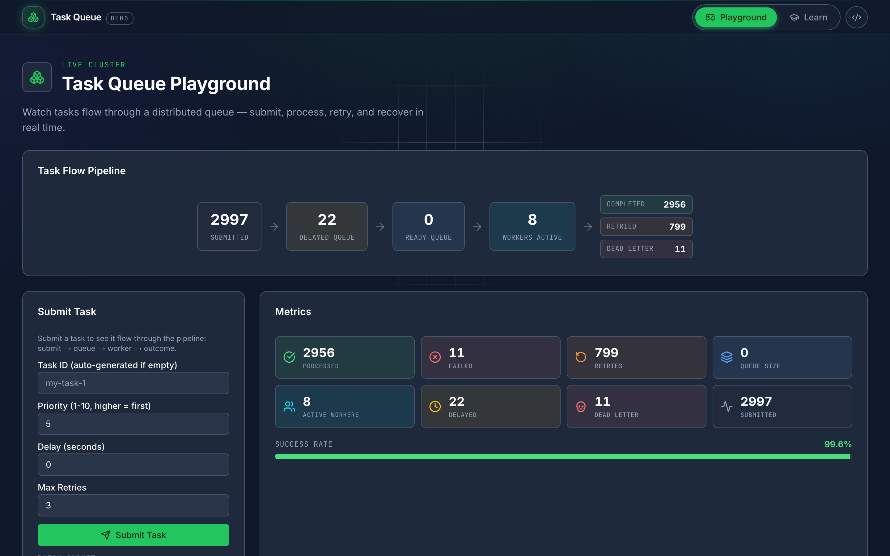
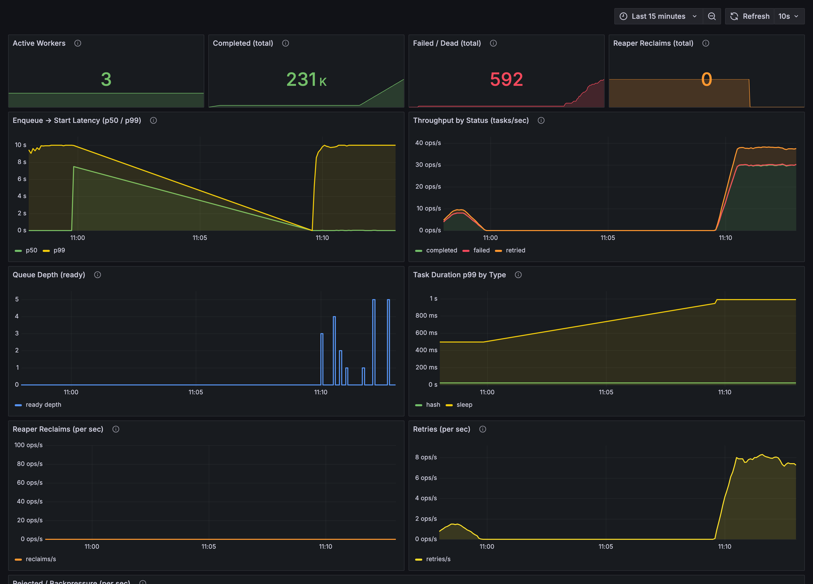
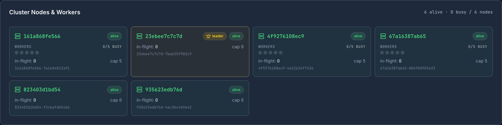
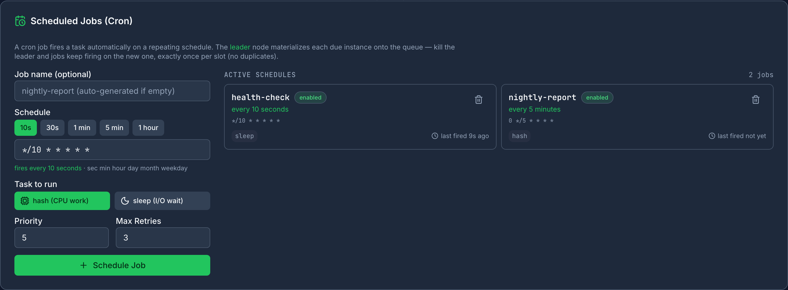
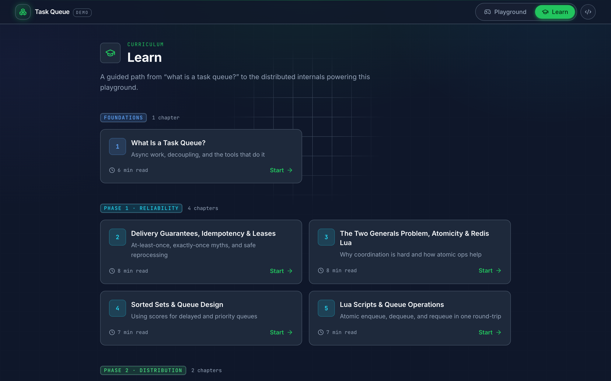

# Task Queue — A Distributed Task Processing System You Can *See*

[](https://github.com/kripa-sindhu-007/task-queue-educational-dashboard/actions/workflows/ci.yml)
[](https://hub.docker.com/r/kripa007/taskqueue-backend)
[](https://hub.docker.com/r/kripa007/taskqueue-frontend)
[](backend/go.mod)
[](LICENSE)

A production-shaped distributed task queue — **at-least-once delivery, worker leases, crash recovery, backpressure, and full Prometheus/Grafana observability** — wrapped in a live dashboard that lets you *watch the internals happen in real time*.

Built with **Go**, **Next.js**, **Redis**, and **Docker**.



---

## Why this exists

Most task-queue tutorials stop at "push a job, pop a job." Real systems have to answer harder questions: *What happens when a worker dies mid-task? How do you not lose work? How do you not lose it twice? What happens when producers outrun consumers?*

This project **implements** the real answers — leases, a reaper, atomic Redis Lua, a doorbell wake-up, queue-depth backpressure — and then **shows them to you**:

- **Watch** tasks flow submit → delay → ready → lease → outcome, live
- **Kill a worker** mid-load and watch the reaper detect it, reclaim its in-flight leases, and rebalance — with **zero task loss**
- **Overload it** and watch backpressure shed excess with `429 + Retry-After` instead of melting down
- **Measure it** — every stage is instrumented; Prometheus + Grafana are wired in and provisioned out of the box

It's honest, too: exactly-once is explicitly **not** attempted (it's a myth over an unreliable network) — the system targets **at-least-once + idempotency**, and the docs say so.

---

## Screenshots

### 🎮 Playground — the live cluster
Submit single tasks or batches and watch the task-flow pipeline, per-node worker pool, queue contents, metrics, and a color-coded activity stream update in real time.



### 📊 Observability — Prometheus + Grafana, provisioned
Enqueue→start latency (p50/p99), throughput by status, queue depth, per-type task duration, reaper reclaims, retries, and backpressure — one auto-provisioned dashboard, no setup.



### 👑 Coordination — leader election & cron
Exactly one scheduler holds the crown and runs the singleton loops (scheduler, reaper, cron). Kill it and the crown migrates while the API stays up. Cron jobs are created and managed right from the dashboard — schedule presets, plain-English translation, live "last fired".





### 📚 Learn — a guided curriculum
Authored chapters from "what is a task queue?" through delivery guarantees, the Two Generals problem, Redis Lua atomicity, distribution, and observability.



---

## Features

**Reliability (at-least-once)**
- Lease-based delivery: a task claimed by a worker lives in a `processing` set with a visibility timeout
- **Reaper** reclaims expired leases (dead or slow workers) → retry with exponential backoff, or dead-letter
- Owner-fencing on ack/nack so a revived worker can't ack a task that was already reclaimed
- Every state transition is an **atomic Redis Lua script** — no read-modify-write races

**Distribution**
- Standalone, horizontally-scalable `worker` replicas (`docker compose --scale worker=N`)
- Heartbeats (TTL keys) + dead-node detection with a grace window so the kill-a-worker demo is visible
- An API-only `backend` plus leader-eligible `scheduler` replicas; workers own execution

**Coordination (leader election + cron)**
- **Leader election** via a Redis lease — exactly one `scheduler` replica runs the delayed scheduler, reaper, and cron; the rest stand by. Kill the leader and the crown migrates (graceful: instant, crash: < lease TTL) while the API never blinks
- **Cron jobs** the leader materializes onto the queue with `{cronID}-{scheduledTs}` IDs + idempotency, so a failover mid-fire never double-fires — managed from the dashboard or `POST /api/cron`
- **Chaos-tested** — `make chaos` kills random workers *and* schedulers under load and asserts zero loss + cron integrity ([`scripts/chaos.sh`](scripts/chaos.sh)); honest split-brain writeup in [`docs/ARCHITECTURE.md`](docs/ARCHITECTURE.md#coordination-leader-election-cron--split-brain-phase-4)

**Performance**
- **Doorbell pickup**: idle workers block on `BLPOP` a signal key instead of sleep-polling — pickup latency drops from ~`PollInterval/2` to sub-millisecond, with `dequeue.lua` byte-for-byte unchanged (correctness preserved)
- **Backpressure**: `MAX_QUEUE_DEPTH` sheds excess submissions early with `429 + Retry-After`, before any write

**Observability**
- Structured `log/slog` JSON, keyed by `task_id` / `node_id`
- Prometheus `/metrics` on a dedicated registry; Grafana auto-provisioned with an 11-panel dashboard
- Load generator (`cmd/loadgen`) + zero-loss soak harness (`scripts/soak.sh`)

---

## Architecture

```
   ┌──────────────┐   HTTP/JSON     ┌──────────────────────┐
   │  Next.js UI  │ ───────────────▶│  backend  :8080      │  API only —
   │  :3000       │◀─────────────── │  LEADER_ELIGIBLE=0   │  runs no singletons
   └──────────────┘    polling      └──────────┬───────────┘
                                               │ atomic Lua
   ┌────────────────────────┐  Redis lease     │
   │  scheduler × N         │  taskqueue:leader │
   │  the elected leader    │◀────────────┐     ▼
   │  runs scheduler·reaper │             │  ┌────────────────────┐
   │  ·cron  (rest stand by)│─────────────┼─▶│      Redis 7       │
   └────────────────────────┘             │  │  ZSETs · hashes    │
   ┌──────────────┐  heartbeat · doorbell │  │  · Lua · leases    │
   │  worker × N  │◀─────────────────────────│  · leader lease    │
   │  :9100       │  Lua lease dequeue/ack   └────────────────────┘
   └──────────────┘                                   ▲ scrape
                        ┌────────────┐                │        ┌──────────┐
                        │ Prometheus │────────────────┴───────▶│ Grafana  │
                        │  :9090     │  (Docker DNS discovery)  │  :3001   │
                        └────────────┘                          └──────────┘
```

Redis is the only coordination bus (no gRPC). `ready` / `delayed` / `processing` are **ZSETs holding task IDs**; the canonical record is a `taskqueue:task:{id}` hash. The delayed scheduler, reaper, and cron are **singletons gated behind a Redis-lease leader election** — see [`docs/ARCHITECTURE.md`](docs/ARCHITECTURE.md#coordination-leader-election-cron--split-brain-phase-4) for the full design, including the honest split-brain analysis.

### Task lifecycle

```
 Submit ──▶ MAX_QUEUE_DEPTH reached? ──yes──▶ 429 + Retry-After   (backpressure, no write)
     │ no
     ▼
 delay > 0 ? ──yes──▶ Delayed ZSET (score = eligible-at) ──scheduler(1s)──┐
     │ no                                                                 │
     ▼                                                                    ▼
 Ready ZSET (score = -priority) ──doorbell wakes an idle worker──▶ Lease (processing ZSET + visibility timeout)
                                                                          │
                                    ┌─────────────────────────────────────┤
                                    ▼                    ▼                 ▼
                                 Success              Failure         Worker dies
                                    │                    │                 │
                                    ▼            retries left?      reaper reclaims
                                 Metrics          │        │        expired lease
                                              yes  │        │ no          │
                                                   ▼        ▼             ▼
                                            Delayed (2^n)  Dead-Letter   retry / DLQ
```

---

## Benchmarks

<div align="center">

**0 tasks lost** across 73 minutes of load · **~580 tasks/s** peak throughput · **~0.86 ms** p99 pickup · **542,613** requests shed cleanly under overload

</div>

Measured on an Apple M5 (10-core, 16 GB) with 3 worker replicas. Every number is from live Prometheus + Redis ground truth — full methodology, caveats, and reproduce commands live in **[`docs/BENCHMARKS.md`](docs/BENCHMARKS.md)**.

### 🛡️ Zero-loss soak

Verified from Redis ground truth after full drain: `submitted == completed + dead-lettered`, all queues empty.

| Regime | Load | Duration | Accepted | Completed | Dead-lettered | Verdict |
|---|:---:|:---:|:---:|:---:|:---:|:---:|
| **Steady-state** | 40/s | 20 min | 47,999 | 47,784 | 215 | ✅ **0 lost** |
| **Chaos** — kill + restore a worker mid-run | 40/s | 8 min | 19,199 | 19,116 | 83 | ✅ **0 lost** · reaper reclaimed 9 leases |
| **Sustained overload** | 250/s | 45 min | 132,385 | 131,883 | 502 | ✅ **0 lost** · 542,613 shed, 0 errors |

### ⚡ Throughput ceiling

Max sustainable rate on 3 workers — bounded by the *slowest task type in the mix*, not CPU headroom.

| Task type | Cost | Sustained | Bounded by |
|---|---|:---:|---|
| `hash` — CPU-bound | 100k SHA rounds | **~580 /s** | CPU across cores |
| `sleep` — latency-bound | 500 ms | **~21 /s** | worker slots ÷ latency |
| mixed `hash:50 / sleep:50` | — | **~49 /s** | the `sleep` leg |

### ⏱️ Pickup latency — the doorbell win

`enqueue_to_start` (task becomes ready → worker claims it):

| Mechanism | p50 | p99 |
|---|:---:|:---:|
| **Doorbell** (`BLPOP` wake) | **~0.35 ms** | **~0.86 ms** |
| Sleep-poll (500 ms interval) | ~250 ms | ~495 ms |

> **~1000× faster wake-up** at low/bursty load. Under saturation, pickup is bounded by queue depth (fundamental queueing) — not the mechanism.

---

## Quick start

### Prerequisites
- [Docker](https://docs.docker.com/get-docker/) + [Docker Compose](https://docs.docker.com/compose/install/)

Go and Node run inside containers — nothing else to install.

### Run

```bash
git clone https://github.com/kripa-sindhu-007/task-queue-educational-dashboard.git
cd task-queue-educational-dashboard

# app + 2 schedulers (for the leader-failover demo) + 3 workers + full observability
docker compose up -d --build --scale scheduler=2 --scale worker=3
```

| Service | URL |
|---|---|
| **Dashboard** | http://localhost:3000 |
| **API** | http://localhost:8080 |
| **Prometheus** | http://localhost:9090 |
| **Grafana** (anon viewer; `admin`/`admin` to edit) | http://localhost:3001 |

### Try it

1. Open the **Playground** → click a batch button (1k / 5k / 10k) to flood the queue
2. Watch the **Task Flow Pipeline** and **Metrics** climb, workers pulse, the **Activity Log** stream events
3. Drive sustained load and kill a worker to see recovery:
   ```bash
   docker compose run --rm loadgen -rate 40 -duration 5m -mix hash:50,sleep:50 &
   docker kill $(docker compose ps -q worker | head -1)   # watch the reaper reclaim + rebalance
   ```
4. Open **Grafana** to see the same run as metrics
5. **Leader failover** — the **Cluster Nodes** panel shows a 👑 on the elected scheduler. Kill it and watch the crown migrate while the API stays up:
   ```bash
   docker kill $(docker compose ps -q scheduler | head -1)   # crown migrates in < 10s
   ```
6. **Cron** — create a schedule from the **Scheduled Jobs** panel (or the API), then kill the leader again and confirm it keeps firing exactly once per slot:
   ```bash
   curl -X POST http://localhost:8080/api/cron -H 'Content-Type: application/json' \
     -d '{"schedule":"*/10 * * * * *","task":{"type":"hash","priority":5,"max_retries":3},"enabled":true}'
   ```
7. Prove it all survives real chaos (random worker + scheduler kills, zero-loss + cron invariants):
   ```bash
   ./scripts/soak.sh          # zero-loss soak (SOAK_CHAOS=1 kills a worker mid-run)
   cd backend && make chaos   # random worker + scheduler kills under load; asserts the invariants
   ```

### Stop

```bash
docker compose down       # stop containers
docker compose down -v    # also remove Redis/Prometheus/Grafana volumes
```

---

## Configuration

Environment variables (set per service in `docker-compose.yml`):

| Variable | Default | Description |
|---|---|---|
| `REDIS_ADDR` | `localhost:6379` | Redis connection address |
| `REDIS_PASSWORD` | _(empty)_ | Redis password |
| `SERVER_PORT` | `8080` | HTTP API port |
| `METRICS_PORT` | `9100` | Prometheus `/metrics` port (workers) |
| `RUN_WORKERS` | `true` | Run in-process workers (compose sets `false` on the server; workers are separate) |
| `WORKER_COUNT` | `5` | Worker goroutines per replica (= node capacity) |
| `VISIBILITY_TIMEOUT_MS` | `30000` | Lease duration before a task is reclaimable |
| `HEARTBEAT_INTERVAL_MS` / `HEARTBEAT_TTL_MS` | `3000` / `10000` | Node heartbeat cadence / TTL |
| `REAPER_INTERVAL_MS` | — | How often the reaper scans for expired leases |
| `DEAD_NODE_GRACE_MS` | — | Grace window before a silent node is tombstoned |
| `SIGNAL_BLOCK_MS` / `SIGNAL_CAP` | `1000` / `1024` | Doorbell block timeout / max buffered wake tokens |
| `MAX_QUEUE_DEPTH` | `0` (off) | Ready-queue cap for backpressure (compose: `20000`) |
| `RETRY_AFTER_SECONDS` | — | `Retry-After` header value when shedding |
| `POLL_INTERVAL_MS` | `500` | Fallback poll interval (doorbell backstop) |
| `LEADER_ELIGIBLE` | `true` | Whether this node competes for leadership (compose: `false` on `backend`, `true` on `scheduler`) |
| `LEADER_TTL_MS` | `10000` | Leader lease TTL; renewed at ⅓ TTL, worst-case crash failover ≈ this |
| `CRON_TICK_MS` | `1000` | How often the leader checks cron jobs for due slots |

---

## API

| Method | Path | Description |
|---|---|---|
| `POST` | `/api/tasks` | Submit a task (`type`: `sleep` / `hash` / `http_fetch`) |
| `GET` | `/api/metrics` | Basic counters |
| `GET` | `/api/metrics/enhanced` | Extended metrics (+ success rate, DLQ size, submitted) |
| `GET` | `/api/nodes` | Live nodes — servers + workers (heartbeat, capacity, in-flight) |
| `GET` | `/api/leader` | Current leader (`{leader_id, is_self}`) — drives the 👑 crown |
| `POST` `GET` `DELETE` | `/api/cron` `/api/cron/{id}` | Create / list / delete cron jobs |
| `GET` | `/api/queues` | Peek ready + delayed contents |
| `GET` | `/api/events?limit=50` | Recent activity log |
| `GET` | `/api/events/cluster` | Cluster-level events (node join/leave, reclaim) |
| `GET` | `/api/tasks/failed` | Dead-lettered tasks |
| `DELETE` | `/api/flush` | Clear all Redis state (dev reset) |
| `GET` | `/api/health` | Health check (pings Redis) |
| `GET` | `/metrics` | Prometheus exposition |

```bash
curl -X POST http://localhost:8080/api/tasks \
  -H 'Content-Type: application/json' \
  -d '{"type":"sleep","priority":8,"max_retries":3,"payload":{"duration_ms":500,"fail_rate":0.3}}'
```

---

## Project structure

```
backend/
  cmd/
    server/       # API + delayed scheduler + reaper
    worker/       # standalone worker replica (register, heartbeat, lease, execute)
    loadgen/      # stdlib-only load generator (rate / ramp / mix)
  internal/
    broker/       # lease core + Lua: dequeue, ack, nack, extend
    queue/        # ready/delayed ZSETs + Lua: promote, signal (doorbell)
    reaper/       # expired-lease reclaim + Lua: reclaim
    election/     # leader election + Lua: renew, release (owner-only CAS)
    cron/         # cron store + leader-materialized scheduler (robfig/cron)
    worker/       # execution loop + doorbell (BLPOP) pickup
    telemetry/    # slog + Prometheus metrics + queue-depth collector
    store/        # Redis client, keys, node heartbeats, events, DLQ
    api/ handler/ # HTTP handlers, router, middleware
    model/ config/# data structs · env-based config
  Dockerfile      # one image → /server, /worker, /loadgen
frontend/
  app/            # / (landing) · /playground · /learn
  components/     # dashboard panels, cluster view, activity log
  lib/            # api client, types, polling hooks
deploy/
  prometheus/     # scrape config (server + workers via Docker DNS SD)
  grafana/        # provisioned datasource + 11-panel dashboard
scripts/
  soak.sh         # zero-loss soak harness (steady + chaos)
  chaos.sh        # random worker + scheduler kills; asserts zero-loss + cron integrity
docs/             # ARCHITECTURE.md · BENCHMARKS.md
docker-compose.yml
```

---

## Tech stack

| Layer | Technology | Why |
|---|---|---|
| Backend | Go 1.25 (stdlib + go-redis + client_golang) | Goroutines fit worker pools; stdlib mux for zero-dep routing |
| Coordination | Redis 7 (ZSETs, hashes, Lua) | Atomic multi-key ops give race-free queue transitions |
| Frontend | Next.js 15 + React 19 + shadcn/ui | App router, dark Modern theme, standalone Docker output |
| Animation | Framer Motion | Live worker/queue/event transitions |
| Observability | Prometheus + Grafana | Auto-provisioned dashboard, Docker DNS service discovery |
| CI/CD | GitHub Actions + Docker Hub | `go vet`/`gofmt`/`test -race` + frontend build gate; publish on `main` |

---

## Contributing

Issues and PRs welcome — see [`CONTRIBUTING.md`](CONTRIBUTING.md). CI runs `go vet`/`gofmt`/`test -race` and a frontend build on every PR.

## License

MIT — see [LICENSE](LICENSE).
