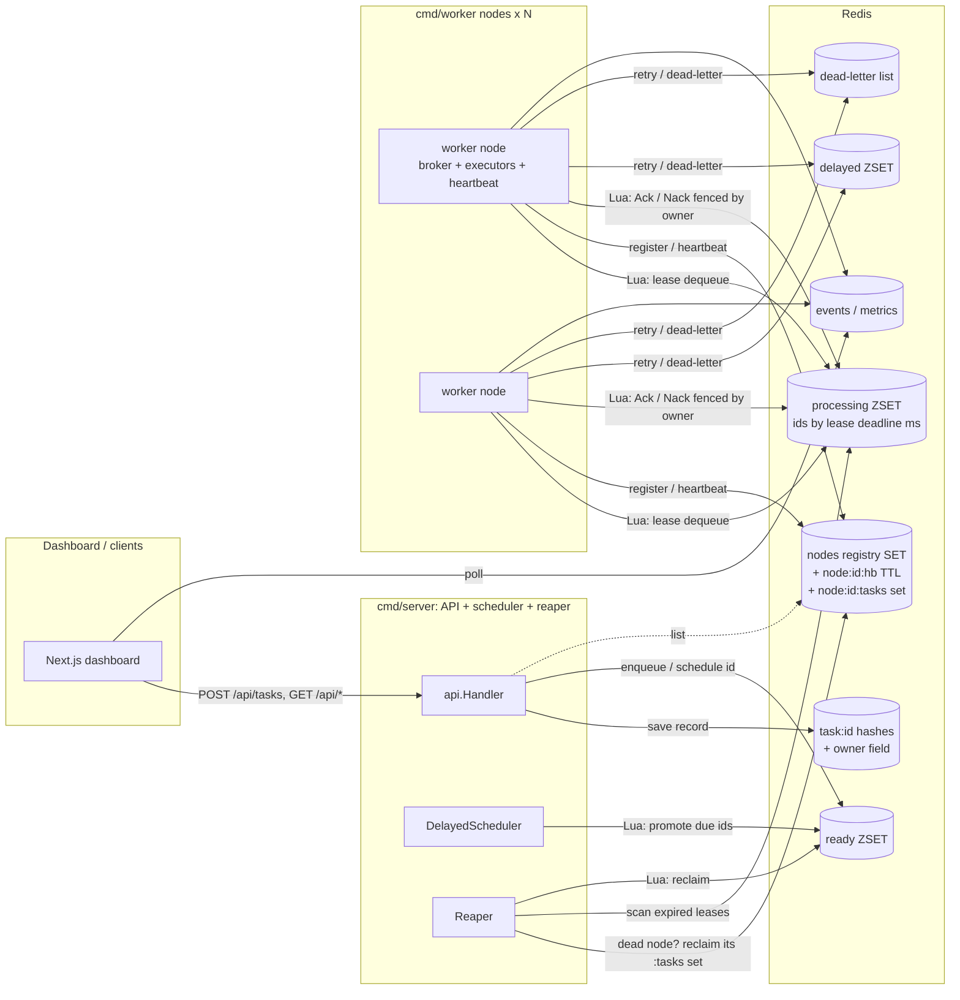
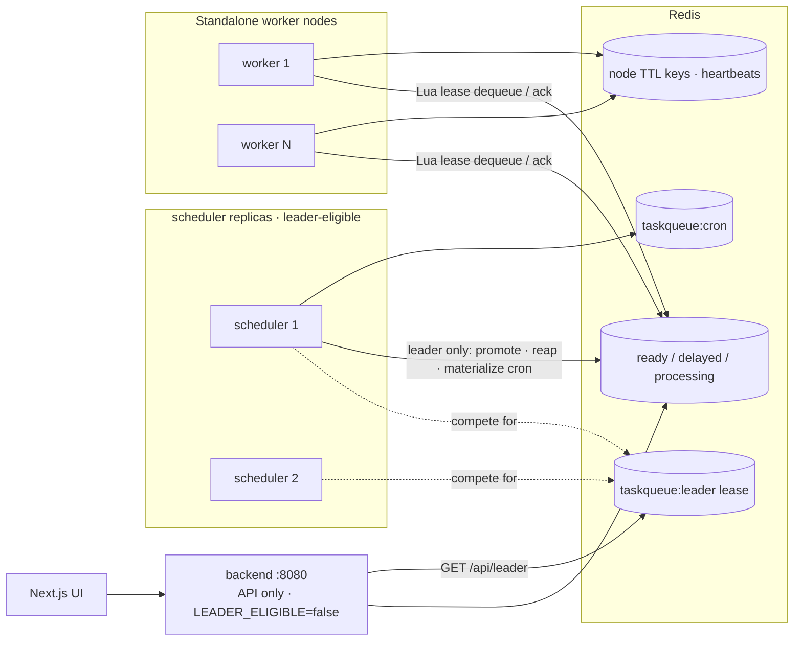

# Architecture

> Living document. Sections marked _(planned)_ describe where later phases take the
> system.

## What this is

An educational distributed task queue that is being evolved into a **distributed
task processing platform with visible internals**. A Go backend coordinates work
through Redis; a Next.js dashboard polls the API and renders the internal state
(queues, workers, events) so you can _watch_ the system behave.

The design bias is **stdlib-first**: standard library + `go-redis` only, with new
dependencies kept deliberately minimal. Redis is the single
coordination bus — no gRPC between components — matching the Sidekiq/Celery/BullMQ
family of systems.

## Current architecture (after Phase 2)

Phase 1 delivered **at-least-once delivery** (leases + reaper). Phase 2 made the
system **distributed**: workers are now standalone processes that join and leave a
live cluster via heartbeat TTL keys, task execution is dispatched through a
type-keyed **handler registry**, and the reaper detects dead nodes and eagerly
reclaims all of their in-flight work.

### Deployment topology

Two binaries share the same `internal/` packages:

- **`cmd/server`** — HTTP API + delayed scheduler + reaper. In single-binary/dev
  mode (`RUN_WORKERS=true`, the default) it also runs an in-process worker node so
  `docker compose up` works with one backend container. In distributed mode
  (`RUN_WORKERS=false`) it is API + scheduler + reaper only.
- **`cmd/worker`** — a standalone worker node: no HTTP surface. It registers itself,
  heartbeats, runs M executor goroutines through the `Broker` interface, and
  deregisters on graceful shutdown. Scale with `docker compose up --scale worker=N`.

Each process is one **node** with identity `{hostname}-{shorthex}`. A node's broker
stamps that ID onto every lease it takes, so its work is attributable and
reclaimable.

### Key components

- **Canonical task records.** Each task's state lives in a Redis hash at
  `taskqueue:task:{id}` (the `store.TaskStore`). Ready/delayed/processing sets hold
  **task IDs only**. Phase 2 added an `owner` field (the node currently leasing it).
- **A `Broker` interface** (`internal/broker`) abstracts delivery
  (`Enqueue/Dequeue/Ack/Nack/ExtendLease`). `RedisBroker` carries the node's ID and
  backs every operation with an atomic Lua script.
- **Processing ZSET** (`taskqueue:processing`): tasks leased here, scored by their
  lease deadline (ms). Not "gone" until Acked.
- **Handler registry** (`internal/handler`): maps task `Type` → handler function.
  Built-ins: `sleep` (the work simulator), `http_fetch` (real HTTP GET, non-2xx =
  failure), `hash` (CPU-bound iterated SHA-256). Unknown types fail cleanly (routed
  to retry/DLQ), never crash the worker.
- **Cluster membership** (`store.NodeStore`): a registry SET plus per-node heartbeat
  TTL keys and per-node ownership sets (see below).
- **Reaper** (`internal/reaper`): each tick it first reclaims dead nodes' work
  eagerly, then sweeps individually expired leases. Reclaim/dead-letter decisions
  read the authoritative task hash inside Lua.
- **Atomic Lua scripts** (`//go:embed`): all critical transitions are single scripts
  to prevent interleaving and crash-induced loss.

### Task lifecycle (after Phase 2)

1. **Submit** → `SubmitTask` assigns an ID (client-supplied or generated), saves
   the canonical record, then enqueues the ID onto `ready` (or `delayed` if the
   task has a delay). Client-supplied IDs are checked for duplicates (409 Conflict
   — idempotent enqueue).
2. **Promote** → the `DelayedScheduler` polls `delayed` every second and moves due
   IDs onto `ready` via an atomic Lua script (no loss window).
3. **Dequeue (lease)** → a worker node calls `broker.Dequeue()` which runs
   `dequeue.lua`: ZPOPMIN ready → ZADD processing with score =
   `now_ms + visibilityTimeout` → HSET status=processing, **owner=nodeID** → SADD
   the ID to that node's `:tasks` set. The task is **leased** to a specific node.
4. **Execute** → the executor dispatches to the handler registered for the task's
   `Type` (`sleep`/`http_fetch`/`hash`); unknown types fail cleanly.
5. **Ack (success)** → `ack.lua` verifies the task is still in processing **and**
   still owned by this node (owner fencing), then ZREM processing → SREM node set →
   HSET status=completed, owner=''. If ownership no longer matches (reclaimed +
   re-leased elsewhere), it returns 0 → `ErrLeaseNotHeld` and the worker skips state
   changes.
6. **Nack (failure)** → `nack.lua` applies the same owner-fenced release, then the
   executor routes to retry (delayed + backoff) or DLQ.
7. **Reaper (safety net)** → each tick: (a) **dead-node reclaim** — for every node
   whose heartbeat expired, reclaim its entire `:tasks` set immediately; (b)
   **lease-expiry sweep** — reclaim individually expired leases. `reclaim.lua`
   ZREM-guards, clears the owner set, and either re-enqueues (retries++) or
   dead-letters. Emits `node_dead` / `reclaimed` / `dead_lettered` events.
8. **ExtendLease** → long-running tasks push back the deadline via `extend.lua`.
9. **Redrive** → POST /api/tasks/failed/redrive drains the DLQ back to ready.
10. Every transition emits an event the dashboard renders.

### Lua scripts (all embedded via `//go:embed`)

| Script | Location | Atomically does |
|---|---|---|
| `dequeue.lua` | `broker/scripts/` | ZPOPMIN ready → ZADD processing → HSET status=processing, owner → SADD node:tasks |
| `ack.lua` | `broker/scripts/` | fence on owner → ZREM processing → SREM node:tasks → HSET completed, owner='' |
| `nack.lua` | `broker/scripts/` | fence on owner → ZREM processing → SREM node:tasks (caller routes retry) |
| `reclaim.lua` | `reaper/scripts/` | ZREM processing → SREM node:tasks → ZADD ready + retries++ OR HSET failed |
| `extend.lua` | `broker/scripts/` | ZSCORE exists check → ZADD processing (new deadline) |
| `promote.lua` | `queue/scripts/` | ZRANGEBYSCORE delayed → ZREM each → ZADD ready with -priority |

### Concurrency model

**ZREM return value is the universal concurrency guard.** In every race (reaper vs
worker, multiple reapers, duplicate promotions), only the caller whose ZREM returns
1 "wins"; everyone else no-ops. This is a single-writer pattern enforced by Redis's
atomic, single-threaded Lua execution.

**Owner fencing (Phase 2).** In a distributed setting a slow worker's lease can
expire, get reclaimed by the reaper, and be re-leased to a *different* node. Ack/Nack
therefore verify `owner == thisNode` **before** touching anything — a stale worker
cannot clobber the new owner's lease. This is lightweight equality fencing; true
monotonic fencing tokens are a Phase 4 concern.

Race scenarios handled:
- **Worker finishes, reaper already reclaimed** → Ack/Nack owner check (or ZREM) fails → `ErrLeaseNotHeld` → executor skips state changes (re-delivery, at-least-once)
- **Reaper fires, worker already Acked** → reclaim.lua ZREM returns 0 → "lost_race", no-op
- **Node falsely declared dead (slow heartbeat)** → its tasks are reclaimed and re-run; when it recovers, its Acks fail the owner check → no double-completion
- **Multiple reapers scan same task** → only one ZREM returns 1
- **Delayed promotion across replicas** → promote.lua ZREM per-task, only winner enqueues

### Configuration (Phase 1 additions)

| Env var | Default | Purpose |
|---|---|---|
| `VISIBILITY_TIMEOUT_MS` | 30000 (30s) | How long a worker has to Ack before lease expires |
| `REAPER_INTERVAL_MS` | 5000 (5s) | How often the reaper scans for expired leases |

Tradeoffs:
- **Visibility timeout too short** → reaper reclaims while worker is still running → duplicate processing (expected under at-least-once)
- **Visibility timeout too long** → dead tasks sit idle before recovery
- **Reaper interval too frequent** → Redis load; too infrequent → slow recovery

## Cluster membership & failure detection (Phase 2)

Membership is tracked with three Redis structures per node:

| Key | Type | Purpose |
|---|---|---|
| `taskqueue:nodes` | SET | registry of all known node IDs |
| `taskqueue:node:{id}:hb` | string w/ TTL | heartbeat — its **existence** means the node is alive |
| `taskqueue:node:{id}:tasks` | SET | task IDs the node currently holds in flight |

A node `Register`s (SADD registry + SET heartbeat with TTL), then refreshes the
heartbeat on an interval. Liveness is derived, not stored: a node is alive iff its
heartbeat key still exists. On graceful shutdown it `Deregister`s; on a hard kill the
key simply expires.

**Failure detection is heartbeat-based.** The reaper treats a registry member with no
heartbeat key as dead and eagerly reclaims its entire `:tasks` set — so recovery is
bounded by the **heartbeat TTL** (~10s), not the visibility timeout (~30s).

**The interval-vs-false-positive tradeoff:** with a 3s beat and 10s TTL, a node
tolerates two missed beats before being declared dead. Shrinking the TTL detects
failures faster but risks false positives (a GC pause or network blip looks like
death), which cause unnecessary reclaims and duplicate execution. Widening it avoids
false positives but slows recovery. The invariant that keeps false positives *safe*
(not *corrupting*) is owner fencing: a wrongly-reclaimed node's late Acks are rejected.

### Configuration (Phase 2 additions)

| Env var | Default | Purpose |
|---|---|---|
| `RUN_WORKERS` | true | Run workers in-process in `cmd/server` (single-binary/dev mode) |
| `HEARTBEAT_INTERVAL_MS` | 3000 (3s) | How often a node refreshes its heartbeat |
| `HEARTBEAT_TTL_MS` | 10000 (10s) | Heartbeat key expiry; must exceed the interval |

## Delivery guarantees

The system provides **at-least-once delivery**. This means:

1. **No task is ever lost.** From the moment a task is submitted, it will eventually
   reach a terminal state (completed or dead-lettered), even if the worker crashes
   mid-execution.
2. **A task may be processed more than once.** If a worker completes work but crashes
   before calling Ack, the reaper will reclaim and re-deliver the task. The second
   worker will process it again.

### Why not exactly-once?

True exactly-once delivery is impossible without **idempotent consumers**. The queue
can only guarantee delivery; it cannot know whether the consumer's side effects
(database writes, API calls, emails) have already been applied. The honest position:

- **At-most-once** (old ZPOPMIN design): simple, fast, lossy. If the worker dies, the
  task is gone.
- **At-least-once** (current lease design): no loss, possible duplicates. The
  foundation everything else builds on.
- **Exactly-once processing**: requires the *consumer* to be idempotent (e.g.,
  deduplication keys in the database, conditional writes). This is the application's
  responsibility, not the queue's. We document this rather than papering over it.

### The idempotency key pattern

For producer-side dedup, clients can supply a task ID. If a record with that ID
already exists, the submission is rejected (409 Conflict). This prevents duplicate
submissions from network retries. Consumer-side idempotency (ensuring processing
the same task twice is harmless) is left to the application.

## Coordination: leader election, cron & split-brain (Phase 4)

The scheduler (promotes delayed tasks) and the reaper (reclaims expired leases) are
**singletons** — running two copies means double-promotion and double-reclaim. Phase 4
makes it safe to run more than one scheduler replica by electing exactly one **leader**
that owns those loops.

### Leader election (Redis lease)

Leadership is a **Redis lease**, not Raft — deliberately, because a lease is a dozen
lines and teaches the real tradeoff honestly:

- Acquire: `SET taskqueue:leader {nodeID} NX PX 10000` (`LEADER_TTL_MS`). `NX` makes it
  a compare-and-set: only one node wins.
- Renew: every `TTL/3`, an **owner-only CAS** in `renew.lua` (`if GET == me then PEXPIRE`)
  extends the lease. On *any* renew error the node **steps down immediately** — we prefer
  **zero leaders** (loops paused, safe) over **two** (loops racing).
- Release: on graceful shutdown, an owner-only CAS in `release.lua` deletes the key so a
  standby takes over **instantly** instead of waiting out the TTL.

`election.Elector.RunWhenLeader(ctx, fn)` runs `fn` under a **leader-scoped context that
is cancelled the instant leadership is lost**, so the scheduler + reaper + cron loops stop
the moment the lease lapses. A node with `LEADER_ELIGIBLE=false` never competes — that is
how the compose topology runs an **API-only `backend`** (always serving `:8080`) alongside
leader-eligible **`scheduler`** replicas that run the loops only when crowned.

### Cron (leader-materialized, idempotent)

Cron jobs (`taskqueue:cron` hash) are materialized **only by the leader**. Each tick the
leader computes each job's latest due slot and enqueues a task with the **deterministic
ID `{cronID}-{scheduledTs}`** on the normal enqueue path — so a cron instance is an
ordinary task (retries, leases, dead-letters, appears in the Activity Log). Before
enqueuing it runs the *same* `TaskStore.Exists` idempotency check the submit handler uses
(see [The idempotency key pattern](#the-idempotency-key-pattern)): if a leader fires slot
`ts` and crashes before recording progress, the next leader recomputes the identical ID,
`Exists` is true, and it **skips** — no duplicate fire. Missed slots after downtime
collapse into a single "run it now" (skip-to-latest).

### Split-brain — the honest part

A lease is not a fence. During a handover there is a window of up to ~`LEADER_TTL_MS`
where the old leader has lost its lease but hasn't noticed yet, while a new leader has
acquired — **two nodes may briefly run the scheduler + reaper + cron**. This does **not**
corrupt state, because every conflicting operation is already idempotent or atomic:

- **Promotion** (`promote.lua`) moves a task out of `delayed` with an atomic ZREM-guard —
  two leaders promoting the same task yields one winner, one no-op.
- **Reclaim** (`reclaim.lua`) has explicit `lost_race` handling; a task can't be reclaimed
  twice.
- **Cron** dedups on the `{cronID}-{ts}` record via `Exists`, and `Enqueue` is a `ZADD`
  by member (set semantics), so a concurrent double-fire collapses to one ready entry.

What a lease **cannot** prevent without **fencing tokens** is a *slow* (not dead) old
leader whose write lands after the new leader has taken over. In this system the blast
radius is one duplicated *at-least-once processing* — which the delivery contract already
permits and idempotent consumers already tolerate — not lost or corrupted work. Choosing
a lease over Raft is a conscious tradeoff: ~10 s worst-case failover and a bounded, benign
overlap window, in exchange for radically less machinery. If you needed strict
single-writer semantics, you'd add fencing tokens (a monotonic epoch checked on every
write) or move to Raft — noted here so the limitation is explicit, not hidden.

> One narrow window worth naming: cron persists the task record *before* enqueuing, so a
> crash *between* those two steps leaves a record that exists but was never queued → the
> next leader skips it → that single slot is lost. This is the same sub-second
> at-least-once window the submit path has; we document it rather than add a distributed
> transaction for one cron tick.

### Verified by chaos

`scripts/chaos.sh` (`make chaos`) exercises all of this at once: it repeatedly kills random
workers (→ reaper reclaim) **and** schedulers (→ leader failover) under sustained load with
a cron job running, then asserts from Redis ground truth that `submitted == processed +
failed` (zero loss), cron kept firing, and the queues drained.

_Phase 3 (observability & performance — slog, Prometheus/Grafana, doorbell pickup,
loadgen, backpressure, benchmarks) shipped earlier; see `docs/BENCHMARKS.md`._

## API endpoints

| Method | Path | Purpose | Phase |
|---|---|---|---|
| POST | /api/tasks | Submit a task (idempotent if client-supplied ID) | P0 |
| GET | /api/tasks/{id} | Get canonical task record | P0 |
| GET | /api/tasks/failed | List dead-lettered tasks | P0 |
| POST | /api/tasks/failed/redrive | Move all DLQ tasks back to ready | P1 |
| GET | /api/metrics | Basic metrics | P0 |
| GET | /api/metrics/enhanced | Extended metrics (delayed/DLQ sizes) | P0 |
| GET | /api/events | Recent task events | P0 |
| GET | /api/workers | Worker states (legacy per-goroutine view; in-process mode) | P0 |
| GET | /api/nodes | Cluster nodes with liveness + in-flight counts | P2 |
| GET | /api/queues | Peek at ready/delayed queues | P0 |
| GET | /api/health | Redis health check | P0 |
| DELETE | /api/flush | Reset all data (dev only) | P0 |
